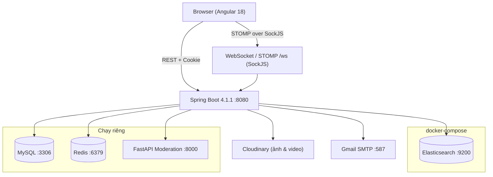
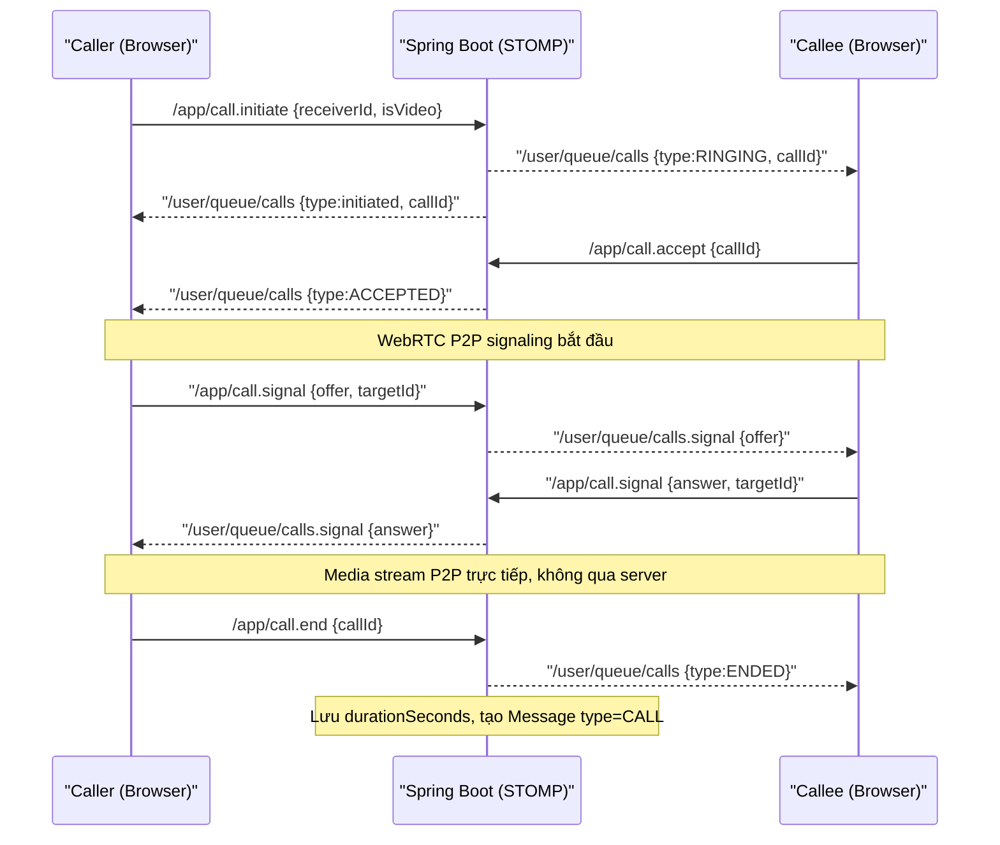

# My Space

Mạng xã hội real-time hỗ trợ đăng bài, chat 1-1, gọi thoại/video WebRTC, và quản lý nội dung qua trang Admin. Backend được xây dựng bằng Spring Boot 4.1.1, frontend bằng Angular 18, giao tiếp real-time qua WebSocket/STOMP.

> **Tên dự án:** tên thư mục gốc là `New`, package backend là `myspace`, route frontend đặt tiêu đề `My Space`. Tên chính thức chưa được khai báo trong `pom.xml` — `<name/>` để trống. `TODO: xác nhận tên chính thức của dự án.`

---

## Mục lục

1. [Ảnh minh họa](#ảnh-minh-họa)
2. [Tính năng](#tính-năng)
3. [Kiến trúc tổng thể](#kiến-trúc-tổng-thể)
4. [Tech stack](#tech-stack)
5. [Cấu trúc thư mục](#cấu-trúc-thư-mục)
6. [Cơ sở dữ liệu](#cơ-sở-dữ-liệu)
7. [Cấu hình môi trường](#cấu-hình-môi-trường)
8. [Hướng dẫn chạy](#hướng-dẫn-chạy)
9. [Tài liệu API](#tài-liệu-api)
10. [Bảo mật](#bảo-mật)
11. [Giới hạn đã biết](#giới-hạn-đã-biết)
12. [Hướng phát triển](#hướng-phát-triển)
13. [Kiểm duyệt ảnh bằng AI](#kiểm-duyệt-ảnh-bằng-ai)
14. [License & Tác giả](#license--tác-giả)

---

## Ảnh minh họa

| Màn hình | Mô tả |
|---|---|
| `docs/images/feed.png` | Trang chủ / feed bài viết |
| `docs/images/chat.png` | Giao diện chat 1-1 |
| `docs/images/video_call.png` | Giao diện gọi video WebRTC |
| `docs/images/notifications.png` | Bảng thông báo real-time |
| `docs/images/admin_dashboard.png` | Trang quản trị Admin |

> Thư mục `docs/images/` chưa tồn tại. Cần chụp màn hình ứng dụng đang chạy và đặt vào đây để hoàn thiện tài liệu.

---

## Tính năng

### Xác thực và bảo mật

- **Đăng ký / đăng nhập** bằng email và mật khẩu.
- **JWT hai tầng:** access token (15 phút, trả về trong response body) + refresh token (24 giờ, lưu trong HttpOnly cookie `refresh_token`).
- **Quên mật khẩu** qua OTP 6 chữ số gửi về Gmail; OTP có thời hạn (lưu trong `users.reset_otp_expiry`).
- **Đổi mật khẩu** khi đã đăng nhập (`POST /api/auth/change-password`).
- **Đăng xuất tất cả thiết bị** — thu hồi toàn bộ refresh token của user (`POST /api/auth/logout-all`).
- **Rate limiting theo IP** bằng Bucket4j: 60 request/phút/IP, lưu bucket trong `ConcurrentHashMap` RAM của process (xem [giới hạn](#giới-hạn-đã-biết)).
- **Phân quyền `ADMIN` / `USER`** qua `@PreAuthorize("hasRole('ADMIN')")` ở các controller admin.

### Mạng xã hội

- **Bài viết (Post):** tạo, chỉnh sửa, xóa; nội dung rich-text HTML (lưu dạng `LONGTEXT`); có `title`, `excerpt`, `slug`, `tag`, `coverImageUrl`, counter `viewCount / likeCount / commentCount`.
- **Đính kèm media:** upload ảnh/video/audio lên Cloudinary qua `POST /api/uploads/media`; video và audio không bị kiểm duyệt AI. Ảnh đi qua AI moderation trước khi lưu.
- **Bình luận:** tạo, xóa bình luận và like bình luận (`CommentLike`).
- **Like bài viết:** `PostLike` với unique constraint `(user_id, post_id)`.
- **Kết bạn:** gửi lời mời (`PENDING`), chấp nhận, từ chối (`FriendRequest`); sau khi chấp nhận tạo bản ghi `Friendship` hai chiều.
- **Trang cá nhân:** xem profile, danh sách bài viết công khai, bộ đếm bạn bè; ảnh đại diện upload có bước cắt (crop) trên trình duyệt trước khi gửi lên.
- **Tìm kiếm:** tích hợp Elasticsearch (chạy riêng qua Docker).
- **Explore:** duyệt bài viết công khai, lọc theo tag.

### Real-time (WebSocket + STOMP)

WebSocket endpoint: `ws://host:8080/ws` (SockJS fallback). Broker in-memory Spring, prefix `/app`, user-destination `/user`.

- **Trạng thái online (Presence):** `PresenceService` theo dõi số session WebSocket mỗi user bằng `ConcurrentHashMap<Long, Integer>` trong RAM. Kết nối → tăng đếm; ngắt kết nối → giảm đếm; về 0 → cập nhật `users.last_seen_at`. REST endpoint `GET /api/presence` trả về tập ID đang online.
- **Thông báo real-time:** gửi đến `/user/{email}/queue/notifications` khi có sự kiện (lời mời kết bạn, like, bình luận...).
- **Chat 1-1:** gửi tin (`/app/chat.send`), sửa tin (`/app/chat.edit`), thu hồi (`/app/chat.delete`), đánh dấu đã đọc (`/app/chat.markRead`). Tin nhắn broadcast đến `/user/{email}/queue/messages`. `Message` hỗ trợ `deleted_at` (soft delete) và `updated_at`. Unique constraint `(sender_id, client_message_id)` chống gửi trùng.
- **Nhật ký cuộc gọi trong chat:** khi cuộc gọi kết thúc/bị từ chối/hủy, một `Message` loại `CALL` được lưu tự động và broadcast vào conversation.
- **Gọi thoại / video WebRTC:**
  - Signaling qua STOMP: `/app/call.initiate`, `/app/call.accept`, `/app/call.reject`, `/app/call.cancel`, `/app/call.end`, `/app/call.signal`.
  - WebRTC signals (offer/answer/ICE candidates) forward đến `/user/{email}/queue/calls.signal` — không lưu DB.
  - Trạng thái cuộc gọi: `RINGING → ACCEPTED → ENDED` (hoặc `REJECTED / CANCELLED / MISSED / FAILED`).
  - Lưu `answeredAt`, `endedAt`, `durationSeconds`, `endReason`, `isVideo`.

### Quản trị (Admin)

Tất cả endpoint admin yêu cầu role `ADMIN`, tiền tố `/api/admin/`.

| Endpoint | Chức năng |
|---|---|
| `GET /api/admin/dashboard/overview` | Thống kê tổng quan (số user, bài viết...) |
| `GET /api/admin/users` | Danh sách user, lọc theo `search / role / status`, phân trang |
| `GET /api/admin/users/{id}` | Chi tiết user |
| `PATCH /api/admin/users/{id}` | Cập nhật user (role, status, thông tin) |
| `GET /api/admin/posts` | Danh sách bài viết, lọc `search / tag`, phân trang |
| `GET /api/admin/posts/{id}` | Chi tiết bài viết |
| `DELETE /api/admin/posts/{id}` | Xóa bài viết |

### Kiểm duyệt ảnh bằng AI

Xem [mục riêng](#kiểm-duyệt-ảnh-bằng-ai).

---

## Kiến trúc tổng thể



> **Lưu ý:** Redis và MySQL chạy ngoài Docker. `docker-compose.yml` trong repo chỉ chứa Elasticsearch.

### Sequence: Đăng nhập với JWT cookie

```mermaid
sequenceDiagram
    participant C as Browser
    participant B as Spring Boot

    C->>B: POST /api/auth/login {email, password}
    B-->>C: 200 {accessToken} + Set-Cookie: refresh_token=...; HttpOnly
    Note over C: Lưu accessToken trong bộ nhớ JS
    C->>B: GET /api/... Authorization: Bearer {accessToken}
    B-->>C: 200 data

    Note over C,B: Khi accessToken hết hạn (15 phút)
    C->>B: POST /api/auth/refresh-token (cookie tự gửi kèm)
    B-->>C: 200 {accessToken mới}
```

### Sequence: Thiết lập cuộc gọi WebRTC



---

## Tech stack

### Backend (`myspace/`)

| Thư viện / Framework | Phiên bản |
|---|---|
| Spring Boot | 4.1.1 |
| Java | 21 |
| Spring Security, WebSocket, Data JPA, Data Redis, Data Elasticsearch, Mail | (kèm Spring Boot 4.1.1) |
| Flyway (core + mysql) | (managed by Spring Boot BOM) |
| MySQL Connector/J | (managed by Spring Boot BOM) |
| JJWT (api / impl / jackson) | 0.11.5 |
| Cloudinary SDK | 1.36.0 |
| Bucket4j | 8.10.1 |
| Jsoup | 1.17.2 |
| Lombok | (managed by Spring Boot BOM) |

### Frontend (`frontend/`)

| Thư viện | Phiên bản |
|---|---|
| Angular | ^18.2.0 |
| Angular CLI | ^18.2.21 |
| TypeScript | ~5.5.2 |
| @stomp/stompjs | ^7.3.0 |
| sockjs-client | ^1.6.1 |
| Bootstrap | ^5.3.8 |
| RxJS | ~7.8.0 |

### AI Moderation (`nsfw-ai/`)

| Thư viện | Phiên bản |
|---|---|
| PyTorch | 2.3.0+cu121 |
| torchvision | 0.18.0+cu121 |
| Pillow | 12.3.0 |
| NumPy | 1.26.4 |
| FastAPI + uvicorn | (từ venv) |

### Hạ tầng

| Dịch vụ | Phiên bản |
|---|---|
| Elasticsearch | 9.4.5 (docker-compose.yml) |
| MySQL | TODO: xác nhận |
| Redis | TODO: xác nhận |

---

## Cấu trúc thư mục

```
.
├── docker-compose.yml          # Elasticsearch 9.4.5
├── .gitignore
├── frontend/                   # Angular 18 SPA
│   ├── src/
│   │   ├── app/
│   │   │   ├── app.routes.ts   # Tất cả routes, lazy-load
│   │   │   ├── core/
│   │   │   │   ├── auth/       # AuthService, roleGuard, JWT interceptor
│   │   │   │   ├── http/       # Interceptors, error utils
│   │   │   │   └── websocket/  # WebSocketService (STOMP), WebRTCService
│   │   │   ├── features/
│   │   │   │   ├── admin/      # Dashboard, quản lý user/post
│   │   │   │   ├── auth/       # Login, Register, Forgot/Reset Password
│   │   │   │   ├── chat/       # Giao diện chat 1-1
│   │   │   │   ├── explore/    # Duyệt bài viết công khai
│   │   │   │   ├── friends/    # Quản lý bạn bè
│   │   │   │   ├── home/       # Feed chính
│   │   │   │   ├── posts/      # Chi tiết bài viết, bình luận
│   │   │   │   ├── profile/    # Trang cá nhân
│   │   │   │   ├── settings/   # Cài đặt hồ sơ, crop avatar
│   │   │   │   └── workspace/  # Post Editor (tạo/sửa bài)
│   │   │   ├── layouts/
│   │   │   │   ├── main-layout/    # Layout chính + sidebar
│   │   │   │   └── admin-layout/   # Layout Admin
│   │   │   └── shared/             # Components, directives dùng chung
│   │   └── assets/images/          # Logo, default avatar
│   └── angular.json
├── myspace/                    # Spring Boot 4.1.1 backend
│   ├── pom.xml
│   └── src/main/
│       ├── java/com/myspace/myspace/
│       │   ├── controller/     # 14 controllers (REST + WebSocket)
│       │   ├── service/        # Business logic
│       │   ├── repository/     # Spring Data JPA
│       │   ├── entity/         # 13 JPA entities
│       │   ├── dto/            # Request / Response DTOs
│       │   ├── security/       # JWT filter, SecurityConfig, RateLimitingFilter
│       │   ├── config/         # CORS, WebSocket, Redis, Cloudinary
│       │   ├── moderation/     # ModerationClient, ModerationResult
│       │   ├── common/         # ApiResponse, PageResponse
│       │   └── document/       # Elasticsearch documents
│       └── resources/
│           ├── application.properties
│           └── db/migration/   # Flyway V1–V7
└── nsfw-ai/                    # FastAPI image moderation
    ├── serve.py                # App + /moderate endpoint
    ├── common.py               # Model builder, transforms
    ├── train.py                # Training script
    ├── models/                 # *.pt model files (gitignored ở data, không ở models)
    └── requirements.txt
```

---

## Cơ sở dữ liệu

Schema được quản lý bằng **Flyway** (V1–V7) kết hợp `spring.jpa.hibernate.ddl-auto=update`. Flyway chạy migration khi khởi động; Hibernate `update` bổ sung cột mới nếu entity thay đổi nhưng không xóa cột cũ.

> **Lưu ý:** Dùng đồng thời `ddl-auto=update` và Flyway có thể gây conflict khi Hibernate tự ý thêm/đổi cột mà Flyway không biết. Nên chuyển về `ddl-auto=validate` ở môi trường ổn định.

### Quan hệ chính (ERD rút gọn)

```mermaid
erDiagram
    users {
        bigint id PK
        varchar email UK
        varchar username UK
        varchar password
        varchar display_name
        varchar avatar_url
        text bio
        varchar status
        varchar reset_otp
        datetime reset_otp_expiry
        bigint role_id FK
        datetime last_seen_at
        datetime created_at
        datetime updated_at
    }
    roles { bigint id PK; varchar name }
    posts {
        bigint id PK
        varchar title
        varchar slug
        longtext content
        varchar cover_image_url
        boolean has_video
        varchar tag
        int view_count
        int like_count
        int comment_count
        bigint author_id FK
        datetime published_at
    }
    comments { bigint id PK; bigint post_id FK; bigint author_id FK; text content }
    post_likes { bigint id PK; bigint user_id FK; bigint post_id FK }
    comment_likes { bigint id PK; bigint user_id FK; bigint comment_id FK }
    friend_requests { bigint id PK; bigint sender_id FK; bigint receiver_id FK; varchar status }
    friendships { bigint id PK; bigint user1_id FK; bigint user2_id FK }
    conversations {
        bigint id PK
        bigint user1_id FK
        bigint user2_id FK
        bigint user1_last_read_message_id
        bigint user2_last_read_message_id
        bigint last_message_id
        datetime last_message_at
    }
    messages {
        bigint id PK
        bigint conversation_id FK
        bigint sender_id FK
        varchar type
        text content
        bigint call_id FK
        varchar client_message_id
        boolean is_read
        datetime deleted_at
        datetime updated_at
    }
    calls {
        bigint id PK
        bigint conversation_id FK
        bigint caller_id FK
        bigint callee_id FK
        varchar status
        datetime answered_at
        datetime ended_at
        int duration_seconds
        varchar end_reason
        boolean is_video
    }
    media_assets {
        bigint id PK
        varchar public_id
        varchar url
        varchar media_type
        varchar mime_type
        bigint owner_id FK
        varchar status
        bigint post_id
    }
    refresh_tokens { bigint id PK; bigint user_id FK; varchar token; boolean revoked; datetime expires_at }

    roles ||--o{ users : role_id
    users ||--o{ posts : author_id
    users ||--o{ comments : author_id
    users ||--o{ post_likes : user_id
    posts ||--o{ post_likes : post_id
    posts ||--o{ comments : post_id
    comments ||--o{ comment_likes : comment_id
    users ||--o{ friend_requests : "sender/receiver"
    users ||--o{ friendships : "user1/user2"
    users ||--o{ conversations : "user1/user2"
    conversations ||--o{ messages : conversation_id
    conversations ||--o{ calls : conversation_id
    calls ||--o| messages : call_id
    users ||--o{ media_assets : owner_id
    users ||--o{ refresh_tokens : user_id
```

### Seed data mặc định (Flyway V2)

| Email | Username | Mật khẩu | Role |
|---|---|---|---|
| `admin@myspace.com` | `admin` | `123456` | ADMIN |
| `user@myspace.com` | `user1` | `123456` | USER |

---

## Cấu hình môi trường

Tất cả cấu hình nằm trong `myspace/src/main/resources/application.properties`.

> ⚠️ **Cảnh báo bảo mật:** File này hiện chứa secret thật và đã được commit lên repo. Xem mục báo cáo cuối tài liệu để biết danh sách các khóa cần rotate.

### Backend

| Khóa | Ý nghĩa | Giá trị mẫu |
|---|---|---|
| `spring.datasource.url` | JDBC URL MySQL | `jdbc:mysql://localhost:3306/myspace` |
| `spring.datasource.username` | Username MySQL | `your_db_user` |
| `spring.datasource.password` | Password MySQL | `your_db_password` |
| `spring.elasticsearch.uris` | URI Elasticsearch | `http://localhost:9200` |
| `spring.data.redis.host` | Host Redis | `localhost` |
| `spring.data.redis.port` | Port Redis | `6379` |
| `jwt.secret` | Secret HS256 (≥ 256 bit) | `your_jwt_secret_here` |
| `jwt.access-token.expiration` | TTL access token (ms) | `900000` |
| `jwt.refresh-token.expiration` | TTL refresh token (ms) | `86400000` |
| `spring.mail.username` | Gmail gửi OTP | `your_email@gmail.com` |
| `spring.mail.password` | Gmail App Password | `your_app_password` |
| `cloudinary.cloud-name` | Cloudinary cloud name | `your_cloud_name` |
| `cloudinary.api-key` | Cloudinary API key | `your_api_key` |
| `cloudinary.api-secret` | Cloudinary API secret | `your_api_secret` |
| `moderation.url` | URL FastAPI service | `http://127.0.0.1:8000` |
| `moderation.api-key` | API key bảo vệ /moderate | (rỗng = không kiểm tra) |
| `spring.servlet.multipart.max-file-size` | Giới hạn upload | `500MB` |

### AI service (`nsfw-ai/`)

| Biến môi trường | Ý nghĩa | Mặc định |
|---|---|---|
| `MODEL_CKPT` | Đường dẫn file `.pt` | `models/resnet18_224_best.pt` |
| `THRESHOLD` | Ngưỡng p_unsafe để từ chối | `0.7` |
| `MODERATION_API_KEY` | API key, rỗng = không kiểm tra | (rỗng) |

---

## Hướng dẫn chạy

### Yêu cầu

| Phần mềm | Phiên bản |
|---|---|
| Java JDK | 21 |
| Node.js | 18 LTS hoặc 20 LTS |
| Angular CLI | 18.x |
| Docker & Docker Compose | Engine 24+ |
| MySQL | 8.0+ |
| Redis | 7.x |
| Python | 3.10+ (chỉ khi chạy AI service) |

```bash
npm install -g @angular/cli@18
```

### Bước 1 — Khởi động Elasticsearch

```bash
docker compose up -d
# Kiểm tra: curl http://localhost:9200
```

### Bước 2 — Chuẩn bị MySQL

```sql
CREATE DATABASE myspace CHARACTER SET utf8mb4 COLLATE utf8mb4_unicode_ci;
```

### Bước 3 — Cấu hình backend

Chỉnh sửa `myspace/src/main/resources/application.properties` với các giá trị thật của bạn (DB, Cloudinary, Gmail, JWT secret).

### Bước 4 — Chạy backend

```bash
cd myspace
.\mvnw spring-boot:run     # Windows
./mvnw spring-boot:run     # Linux/macOS
```

Flyway tự chạy V1–V7. Seed data (admin/user) được tạo ở V2. Backend chạy tại `http://localhost:8080`.

### Bước 5 — Chạy frontend

```bash
cd frontend
npm install
npm start
```

Frontend chạy tại `http://localhost:4200`.

### Bước 6 — Chạy AI Moderation service

> ⚠️ **Bắt buộc để upload ảnh hoạt động.** `ModerationClient` trong Spring Boot gọi `http://127.0.0.1:8000` đồng bộ mỗi khi upload ảnh. Nếu service không chạy, **mọi upload ảnh trả HTTP 503**. Không có công tắc tắt kiểm duyệt trong `application.properties` hay code — đã kiểm tra toàn bộ `application.properties` và `ModerationClient.java`, không tìm thấy property `moderation.enabled` hay logic bypass nào.

File model `.pt` **không nằm trong repo** (gitignored). `TODO: xem hướng dẫn download hoặc train model trong `nsfw-ai/README.md` — file này chưa tồn tại, cần bổ sung.`

```bash
cd nsfw-ai
python -m venv venv
.\venv\Scripts\activate      # Windows
# source venv/bin/activate   # Linux/macOS

pip install -r requirements.txt

# Đặt MODEL_CKPT nếu dùng model khác mặc định
uvicorn serve:app --host 127.0.0.1 --port 8000

# Kiểm tra:
curl http://127.0.0.1:8000/health
```

### Tài khoản mặc định (từ Flyway V2)

| Email | Mật khẩu | Role |
|---|---|---|
| `admin@myspace.com` | `123456` | ADMIN |
| `user@myspace.com` | `123456` | USER |

---

## Tài liệu API

| File | Nội dung |
|---|---|
| `myspace/HELP.md` | Hướng dẫn Maven Wrapper (do Spring Initializr tạo) |

> `TODO:` Các file `.md` mô tả API (`call.md`, `websocket.md`, `message.md`, v.v.) và bộ Postman collection không tìm thấy trong repo. Cần bổ sung hoặc xác nhận vị trí.

---

## Bảo mật

### Đã triển khai

- **HttpOnly cookie** cho refresh token (`ResponseCookie.httpOnly(true)` trong `AuthController`).
- **Rate limiting** 60 req/phút/IP bằng Bucket4j (`RateLimitingFilter`).
- **Phân quyền endpoint Admin** bằng `@PreAuthorize("hasRole('ADMIN')")`.
- **JWT HS256**, TTL access token 15 phút, refresh token 24 giờ.
- **CORS** chỉ cho phép `http://localhost:4200` với `allowCredentials(true)`.

### Cần làm trước khi deploy production

- **Chuyển secret ra ngoài repo** — dùng biến môi trường hoặc Vault (xem danh sách secret bên dưới).
- **Bật HTTPS** và đặt `cookie.secure(true)` trong `AuthController.generateAuthCookieResponse()` (hiện `secure(false)`).
- **Thu hẹp CORS** — thay `localhost:4200` bằng domain thật trong `CorsConfig`.
- **Thu hẹp WebSocket CORS** — `WebSocketConfig` đang dùng `setAllowedOriginPatterns("*")`.
- **Thêm SameSite** cho cookie refresh token.

---

## Giới hạn đã biết

1. **Presence không scale ngang:** `PresenceService` lưu session count trong `ConcurrentHashMap` trên heap JVM (`PresenceService.java:16`). Khi chạy nhiều instance, mỗi instance có map riêng → trạng thái online không đồng bộ. Cần Redis Pub/Sub hoặc sticky session.

2. **Rate limiting không scale ngang:** `RateLimitingFilter` cũng dùng `ConcurrentHashMap` (`RateLimitingFilter.java:22`) — giới hạn 60 req/phút chỉ áp dụng per-instance. Cần Bucket4j với Redis backend.

3. **WebRTC chỉ có STUN, không có TURN:** ICE servers cấu hình cứng trong `webrtc.service.ts:47-50` chỉ gồm hai STUN server của Google. Cuộc gọi sẽ thất bại khi cả hai phía đều sau NAT đối xứng hoặc mạng 4G/5G. Cần deploy TURN server (ví dụ: coturn).

4. **CORS backend cứng `localhost:4200`:** `CorsConfig.java:20` — phải sửa khi deploy.

5. **Kiểm duyệt ảnh bắt buộc, không có fallback:** Upload ảnh trả 503 nếu AI service không chạy. Không có circuit-breaker hay cờ `moderation.enabled`.

6. **Schema quản lý bằng cả Flyway lẫn `ddl-auto=update`:** Tiềm ẩn xung đột. Nên chuyển `ddl-auto=validate` ở production.

7. **Secret thật trong repo:** `application.properties` chứa credential thật và đã được commit (xem báo cáo bên dưới).

8. **Chưa xác nhận có unit test / integration test:** Dependency `*-test` có trong pom.xml nhưng cần kiểm tra `src/test/java/` để xác nhận (`TODO`).

---

## Hướng phát triển

- Presence và rate limiting qua Redis để hỗ trợ scale ngang.
- TURN server để cuộc gọi ổn định sau NAT.
- Circuit breaker (Resilience4j) cho AI moderation, tránh block upload khi service AI không ổn định.
- Thêm property `moderation.enabled` để tắt/bật kiểm duyệt qua config.
- Viết unit test và integration test.
- Chuẩn hóa phân trang (zero/one-based page index đang không đồng nhất).
- Hàng chờ kiểm duyệt thủ công cho Admin (chưa implement).
- Chuyển `ddl-auto=update` sang `validate` ở môi trường staging/production.
- Đưa secret ra biến môi trường, xóa khỏi repo.

---

## Kiểm duyệt ảnh bằng AI

**Mục tiêu:** phát hiện ảnh có nội dung bạo lực / vũ khí trước khi lưu lên Cloudinary.

**Luồng:**
1. User upload ảnh → `UploadServiceImpl` đọc bytes.
2. Gọi `POST http://127.0.0.1:8000/moderate` (FastAPI, multipart/form-data).
3. FastAPI trả `{"p_unsafe": 0.xx, "status": "APPROVED"|"REJECTED"}`.
4. `APPROVED` → upload lên Cloudinary, lưu `MediaAsset`.
5. `REJECTED` → trả HTTP **422**, không lưu gì, Cloudinary không bị gọi.
6. AI service lỗi/timeout → trả HTTP **503**.

**Model:** ResNet-18 fine-tuned, ngưỡng mặc định `THRESHOLD=0.7`. File `.pt` lưu trong `nsfw-ai/models/` (không gitignore thư mục models, chỉ gitignore data/runs/venv).

**Giới hạn chính:** chỉ nhận diện bạo lực/vũ khí; chưa nhận diện nội dung khiêu dâm; không quét video/audio; không có luồng kháng cáo; giới hạn file 10 MB.

Tham khảo thêm: `nsfw-ai/README.md` — *(chưa tồn tại, cần bổ sung hướng dẫn train/chạy model).*

---

## License & Tác giả

**License:** `TODO — không tìm thấy file LICENSE trong repo.`

**Tác giả:** `TODO — `<developers/>` trong pom.xml để trống.`

---

---

## Báo cáo

### (1) Mâu thuẫn giữa tài liệu cũ và code thực tế

- Không tìm thấy các file `project_overview.md`, `mota.md`, `call.md`, `websocket.md`, `online.md`, `notifice.md`, `message.md`, `editMessage.md`, `video.md`, `desPost.md`, `authPostman.md`, `postman.md` trong repo.
- Tài liệu cũ (theo mô tả context) ghi **"Spring Boot 3 + Java 21"** và **"Angular 17+"** — thực tế trong `pom.xml`: Spring Boot **4.1.1**; trong `package.json`: Angular **^18.2.0**.

### (2) TODO còn lại

- Tên chính thức của dự án (pom.xml `<name/>` trống).
- Phiên bản MySQL và Redis đang dùng.
- Bộ Postman collection không tìm thấy trong repo.
- `nsfw-ai/README.md` chưa tồn tại.
- Xác nhận file test trong `myspace/src/test/java/`.
- `docs/images/` — chưa có ảnh chụp màn hình.

### (3) Secret phát hiện trong `application.properties`

File `myspace/src/main/resources/application.properties` **không có trong `.gitignore`** và đã được commit lên repo. Các khóa cần rotate ngay:

| Khóa |
|---|
| `spring.datasource.password` |
| `jwt.secret` |
| `spring.mail.username` |
| `spring.mail.password` |
| `cloudinary.cloud-name` |
| `cloudinary.api-key` |
| `cloudinary.api-secret` |

### (4) Tính năng trong tài liệu/context nhưng không thấy trong code

- **Admin Review Queue:** context mô tả luồng kiểm duyệt thủ công cho media status `REVIEW` — **không implement** trong controller/service/entity hiện tại.
- **Cột moderation trong MediaAsset:** context đề cập `moderation_status`, `moderation_score`, `reviewed_by`, `reviewed_at` — **không tồn tại** trong `MediaAsset.java`; entity chỉ có `status` với giá trị `TEMPORARY` / `ATTACHED`.
