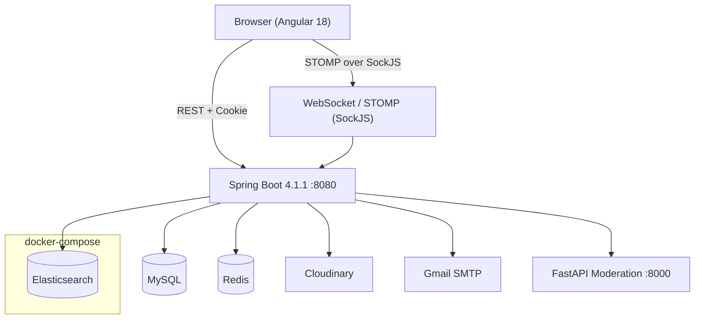
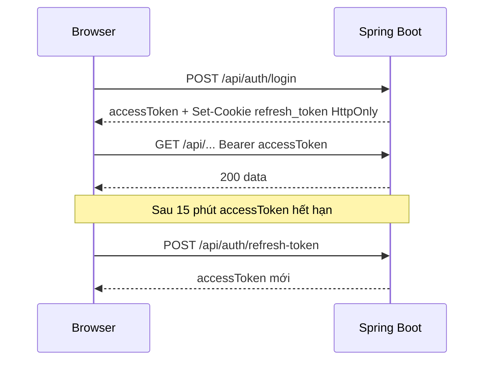
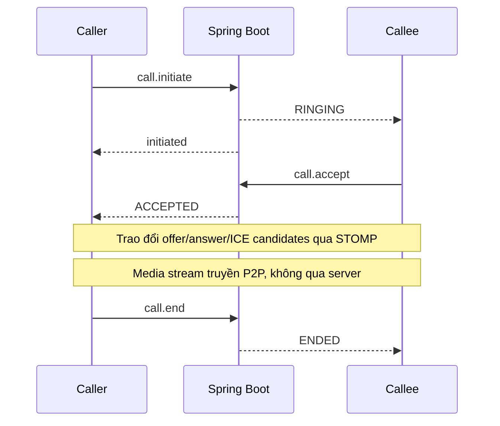
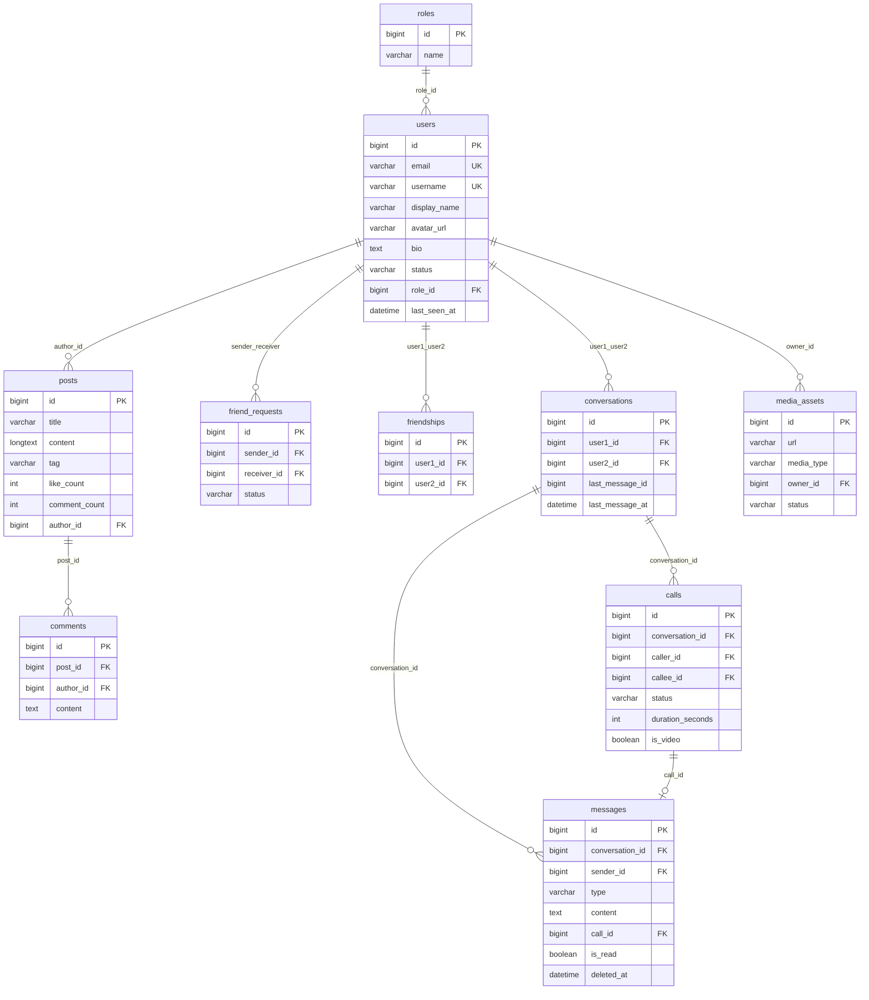

# My Space

Mạng xã hội real-time với đầy đủ tính năng: đăng bài, chat 1-1, gọi thoại/video WebRTC, thông báo tức thì và trang quản trị. Backend Spring Boot 4.1.1, frontend Angular 18, giao tiếp real-time qua WebSocket/STOMP.

---

## Mục lục

1. [Tính năng](#tính-năng)
2. [Kiến trúc tổng thể](#kiến-trúc-tổng-thể)
3. [Tech stack](#tech-stack)
4. [Cấu trúc thư mục](#cấu-trúc-thư-mục)
5. [Cơ sở dữ liệu](#cơ-sở-dữ-liệu)
6. [Cấu hình môi trường](#cấu-hình-môi-trường)
7. [Hướng dẫn chạy](#hướng-dẫn-chạy)
8. [Bảo mật](#bảo-mật)
9. [Giới hạn và hướng phát triển](#giới-hạn-và-hướng-phát-triển)
10. [Kiểm duyệt ảnh bằng AI](#kiểm-duyệt-ảnh-bằng-ai)

---

## Tính năng

### Xác thực và bảo mật

- **Đăng ký / đăng nhập** bằng email và mật khẩu.
- **JWT hai tầng:** access token ngắn hạn (15 phút) + refresh token (24 giờ) lưu trong **HttpOnly cookie**.
- **Quên mật khẩu** qua OTP 6 chữ số gửi về Gmail, có thời hạn.
- **Đổi mật khẩu** khi đã đăng nhập, đăng xuất tất cả thiết bị (thu hồi toàn bộ refresh token).
- **Rate limiting** 60 request/phút/IP bằng Bucket4j.
- **Phân quyền ADMIN / USER**, toàn bộ chức năng admin được bảo vệ ở cấp method.

### Mạng xã hội

- **Bài viết:** tạo, chỉnh sửa, xóa bài rich-text với tiêu đề, tag, ảnh bìa; đính kèm ảnh, video, audio lên Cloudinary.
- **Tương tác:** like bài viết, bình luận, like bình luận.
- **Kết bạn:** gửi lời mời, chấp nhận, từ chối; lưu quan hệ hai chiều.
- **Trang cá nhân:** thông tin, bài viết công khai, số bạn bè; đổi avatar với bước crop trên trình duyệt.
- **Tìm kiếm** full-text bằng Elasticsearch.
- **Explore:** duyệt bài viết công khai, lọc theo tag.

### Real-time (WebSocket + STOMP)

- **Trạng thái online:** hiển thị ai đang online theo thời gian thực, lưu thời điểm offline.
- **Thông báo tức thì:** lời mời kết bạn, like, bình luận — không cần tải lại trang.
- **Chat 1-1:** gửi, sửa, thu hồi tin nhắn; đánh dấu đã đọc; chống gửi trùng khi mạng không ổn định.
- **Gọi thoại và video WebRTC:** signaling qua STOMP, media stream P2P trực tiếp giữa hai trình duyệt; hỗ trợ đổ chuông, từ chối, hủy, lưu thời lượng cuộc gọi.
- **Nhật ký cuộc gọi:** cuộc gọi kết thúc hoặc bị từ chối tự động hiện trong hộp chat.

### Quản trị (Admin)

Giao diện Admin tách biệt, bảo vệ bằng role `ADMIN`. Các tính năng:

| Nhóm | Chức năng |
|---|---|
| **Dashboard** | Thống kê tổng quan: tổng số user, bài viết đang có trong hệ thống |
| **Quản lý user** | Xem danh sách, tìm kiếm/lọc theo role và trạng thái, xem chi tiết, cập nhật role/thông tin |
| **Quản lý bài viết** | Xem danh sách, tìm kiếm/lọc theo tag, xem chi tiết, xóa bài vi phạm |

### Kiểm duyệt ảnh bằng AI

Mỗi ảnh được kiểm tra tự động trước khi lưu lên Cloudinary. Xem chi tiết tại [mục cuối](#kiểm-duyệt-ảnh-bằng-ai).

---

## Kiến trúc tổng thể



> Redis và MySQL chạy ngoài Docker. `docker-compose.yml` trong repo chỉ chứa Elasticsearch.

### Luồng đăng nhập (JWT cookie)



### Luồng thiết lập cuộc gọi WebRTC



---

## Tech stack

### Backend

| Thành phần | Phiên bản |
|---|---|
| Java | 21 |
| Spring Boot | 4.1.1 |
| Spring Security + JWT (JJWT) | 4.1.1 / 0.11.5 |
| Spring WebSocket + STOMP | 4.1.1 |
| Spring Data JPA + Flyway | 4.1.1 |
| Spring Data Redis | 4.1.1 |
| Spring Data Elasticsearch | 4.1.1 |
| Cloudinary SDK | 1.36.0 |
| Bucket4j (rate limiting) | 8.10.1 |
| Lombok | — |

### Frontend

| Thành phần | Phiên bản |
|---|---|
| Angular | ^18.2.0 |
| TypeScript | ~5.5.2 |
| @stomp/stompjs + sockjs-client | 7.3.0 / 1.6.1 |
| Bootstrap | ^5.3.8 |
| RxJS | ~7.8.0 |

### AI Moderation

| Thành phần | Phiên bản |
|---|---|
| Python | 3.10+ |
| PyTorch | 2.3.0+cu121 |
| torchvision | 0.18.0+cu121 |
| FastAPI + uvicorn | — |

### Hạ tầng

| Dịch vụ | Phiên bản |
|---|---|
| MySQL | 8.0+ |
| Redis | 7.x |
| Elasticsearch | 9.4.5 |

---

## Cấu trúc thư mục

```
.
├── docker-compose.yml          # Elasticsearch
├── frontend/                   # Angular 18 SPA
│   └── src/app/
│       ├── core/               # Auth service, JWT interceptor, WebSocket, WebRTC
│       ├── features/           # admin, auth, chat, explore, friends,
│       │                       # home, posts, profile, settings, workspace
│       ├── layouts/            # Main layout, Admin layout
│       └── shared/             # Components và directives dùng chung
├── myspace/                    # Spring Boot backend
│   └── src/main/
│       ├── java/com/myspace/myspace/
│       │   ├── controller/     # 14 REST + WebSocket controllers
│       │   ├── service/        # Business logic
│       │   ├── entity/         # 13 JPA entities
│       │   ├── security/       # JWT filter, SecurityConfig, RateLimitingFilter
│       │   ├── config/         # CORS, WebSocket, Redis, Cloudinary
│       │   └── moderation/     # ModerationClient, ModerationResult
│       └── resources/
│           ├── application.properties
│           └── db/migration/   # Flyway V1 (schema) + V2 (seed)
└── nsfw-ai/                    # FastAPI image moderation service
    ├── serve.py                # API endpoint /moderate
    ├── train.py                # Script huấn luyện model
    ├── models/                 # File .pt đã train
    └── requirements.txt
```

---

## Cơ sở dữ liệu

Schema khởi tạo và quản lý hoàn toàn bằng **Flyway**: `V1__init_schema.sql` (toàn bộ bảng, khóa, index) và `V2__seed_data.sql` (role + tài khoản mẫu). Hibernate chạy `ddl-auto=validate`, chỉ kiểm tra entity khớp với DB — mọi thay đổi schema phải thêm migration mới (`V3__...`).



### Tài khoản seed mặc định (Flyway V2)

| Email | Mật khẩu | Role |
|---|---|---|
| `admin@myspace.com` | `Admin@123` | admin |
| `user@myspace.com` | `User@123` | user |

Đổi mật khẩu ngay sau lần đăng nhập đầu tiên.

---

## Cấu hình môi trường

Sao chép `myspace/src/main/resources/application.properties.example` thành `application.properties`. Các secret được đọc từ biến môi trường (`DB_PASSWORD`, `JWT_SECRET`, `MAIL_USERNAME`, `MAIL_APP_PASSWORD`, `CLOUDINARY_CLOUD_NAME`, `CLOUDINARY_API_KEY`, `CLOUDINARY_API_SECRET`, ...) nên không cần ghi secret thật vào file. **Không commit `application.properties` lên repo.**

### Backend

| Khóa | Ý nghĩa |
|---|---|
| `spring.datasource.url` | JDBC URL MySQL |
| `spring.datasource.username` / `password` | Tài khoản MySQL |
| `spring.elasticsearch.uris` | URI Elasticsearch |
| `spring.data.redis.host` / `port` | Kết nối Redis |
| `jwt.secret` | Secret HS256 (tối thiểu 256 bit) |
| `jwt.access-token.expiration` | TTL access token (ms), mặc định 900000 |
| `jwt.refresh-token.expiration` | TTL refresh token (ms), mặc định 86400000 |
| `spring.mail.username` / `password` | Gmail App Password dùng gửi OTP |
| `cloudinary.cloud-name` / `api-key` / `api-secret` | Cloudinary credentials |
| `moderation.url` | URL FastAPI service, mặc định `http://127.0.0.1:8000` |
| `moderation.api-key` | API key bảo vệ /moderate, bỏ trống = không kiểm tra |

### AI service — biến môi trường

| Biến | Ý nghĩa | Mặc định |
|---|---|---|
| `MODEL_CKPT` | Đường dẫn file .pt | `models/resnet18_224_best.pt` |
| `THRESHOLD` | Ngưỡng từ chối (0–1] | `0.7` |
| `MODERATION_API_KEY` | API key, bỏ trống = bỏ qua | — |

---

## Hướng dẫn chạy

### Yêu cầu

| Phần mềm | Phiên bản |
|---|---|
| Java JDK | 21 |
| Node.js | 18 LTS hoặc 20 LTS |
| Angular CLI | 18.x (`npm i -g @angular/cli@18`) |
| Docker | Engine 24+ |
| MySQL | 8.0+ |
| Redis | 7.x |
| Python | 3.10+ (chỉ khi chạy AI service) |

### 1. Khởi động Elasticsearch

```bash
docker compose up -d
```

### 2. Tạo database MySQL

```sql
CREATE DATABASE myspace CHARACTER SET utf8mb4 COLLATE utf8mb4_unicode_ci;
```

### 3. Cấu hình và chạy backend

Tạo `application.properties` từ file `.example` và điền thông tin, sau đó:

```bash
cd myspace
.\mvnw spring-boot:run        # Windows
./mvnw spring-boot:run        # Linux / macOS
```

Lần chạy đầu trên DB rỗng, Flyway tự chạy V1 (schema) + V2 (seed). Backend chạy tại `http://localhost:8080`.

### 4. Chạy frontend

```bash
cd frontend
npm install
npm start
```

Frontend chạy tại `http://localhost:4200`.

### 5. Chạy AI Moderation service

Upload ảnh yêu cầu service này đang chạy. File model `.pt` cần có trong `nsfw-ai/models/` (không có trong repo — xem hướng dẫn train trong `nsfw-ai/`).

```bash
cd nsfw-ai
python -m venv venv
.\venv\Scripts\activate       # Windows
# source venv/bin/activate    # Linux / macOS

pip install -r requirements.txt
uvicorn serve:app --host 127.0.0.1 --port 8000
```

---

## Bảo mật

**Đã triển khai:**

- Refresh token lưu trong **HttpOnly cookie**, không truy cập được từ JavaScript.
- **Rate limiting** 60 req/phút/IP bằng Bucket4j.
- Toàn bộ endpoint admin yêu cầu role `ADMIN`.
- JWT HS256, access token ngắn hạn (15 phút).
- CORS chỉ cho phép `localhost:4200` với `credentials: true`.

**Lưu ý khi deploy production:**

- Đưa credential (DB, JWT, Cloudinary, Gmail) ra biến môi trường, không commit vào repo.
- Bật HTTPS và đặt `cookie.secure(true)`.
- Cập nhật CORS về domain thật (cả REST và WebSocket).

---

## Giới hạn và hướng phát triển

| Giới hạn | Hướng xử lý |
|---|---|
| Trạng thái online và rate limiting lưu trong RAM — không scale ngang | Redis Pub/Sub cho presence, Bucket4j Redis backend cho rate limit |
| WebRTC chỉ có STUN (Google), gọi qua NAT/4G có thể thất bại | Deploy TURN server (coturn) |
| Upload ảnh trả 503 nếu AI service không chạy, chưa có circuit-breaker | Tích hợp Resilience4j, thêm cờ `moderation.enabled` |
| Chưa có unit test / integration test | Spring Boot Test + Testcontainers |

---

## Kiểm duyệt ảnh bằng AI

Mỗi ảnh upload (bài viết hoặc avatar) được kiểm tra tự động qua FastAPI trước khi lưu lên Cloudinary:

1. Spring Boot đọc bytes ảnh và gọi `POST /moderate` trên FastAPI service.
2. Model **ResNet-18 fine-tuned** phân tích và trả về xác suất vi phạm (`p_unsafe`) cùng quyết định `APPROVED` / `REJECTED`.
3. `REJECTED` → Spring Boot trả **HTTP 422**, ảnh không được lưu.
4. `APPROVED` → upload lên Cloudinary bình thường.
5. Service AI không phản hồi → **HTTP 503**.

**Giới hạn hiện tại:** chỉ phát hiện bạo lực/vũ khí; chưa xử lý nội dung khiêu dâm; không quét video/audio; giới hạn 10 MB/ảnh.
